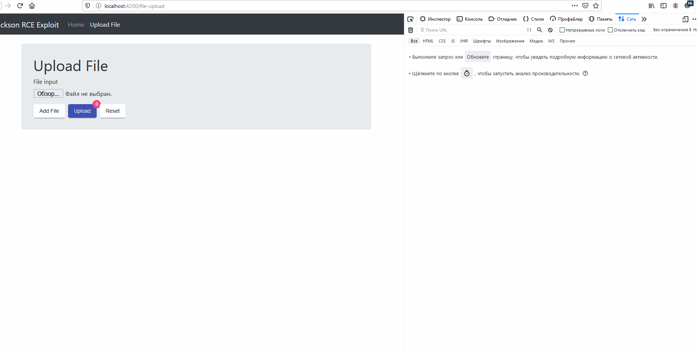

# Demo-Exploit-Jackson-RCE
This project serves as an example web application to test attack on the Jackson-databind vulnerability [CVE-2017-17485](https://cve.mitre.org/cgi-bin/cvename.cgi?name=CVE-2017-17485).  

## Build
Build and package spring boot and angular7 into a deployable war file.
> `mvn package`

## Run
Which automatically opens a web browser at `http://localhost:4200`. 
> `backend/mvn spring-boot:run`                                  

## Demo 

